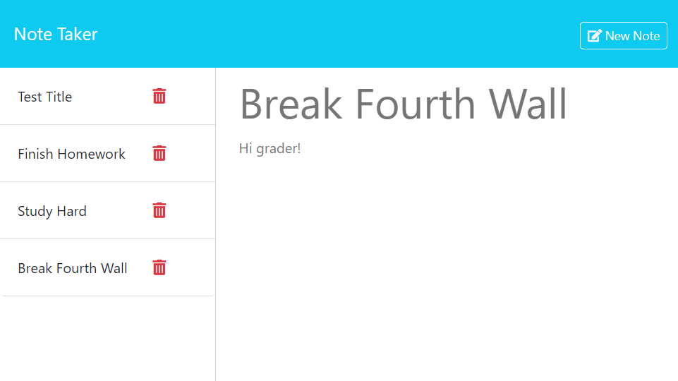

# Note Taker
This project uses node and express to bring functionality to the provided note taking website's starter code. The site is a simple note-taking application, which can create new notes, and view and delete existing notes. Note data and CRUD actions on that data are handled via GET, POST, and DELETE callouts to the server.

## Site Link & Screenshot

Site Link: https://c11-note-taker-bi41.onrender.com

## Code References

UUId
* Purpose: Add unique Id to each note record
* Source: https://www.npmjs.com/package/uuid
* Place(s) Used: `apiNotes.js`, POST endpoint handler

ReadFileSync Encoding
* Purpose: Resolve issue with readFileSync returning buffer instead of file data
* Source: https://stackoverflow.com/a/48818444/8032508
* Place(s) Used: `routerUtil.js`, `readFileSync` function within `readFile` function

Filter Array Via Object Property
* Purpose: Filter out an object from array based on one of the object's properties
* Source: https://stackoverflow.com/a/15287919/8032508
* Place(s) Used: `routeUtil.js`, `deleteNoteFromDatabase` function